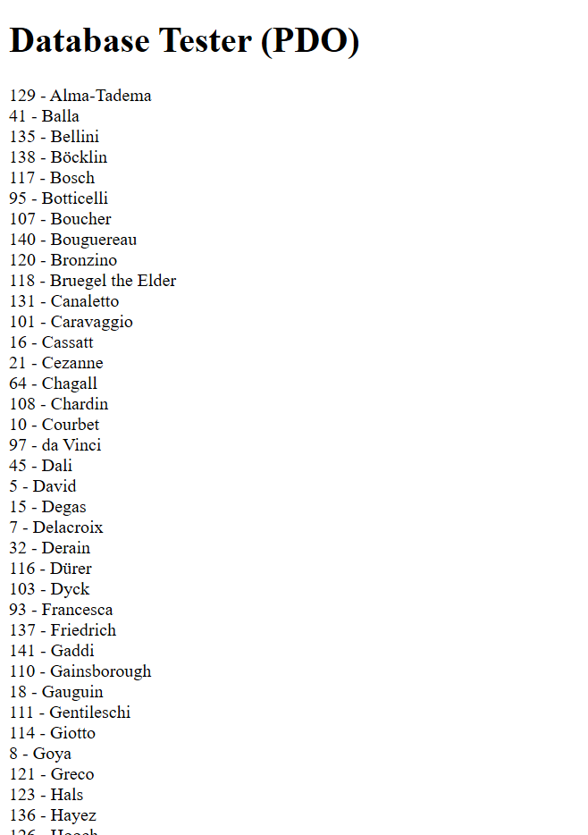
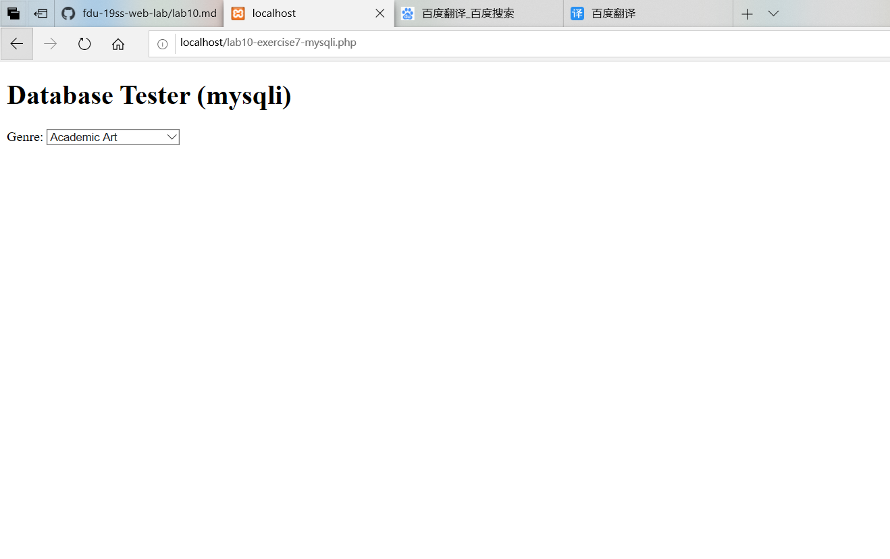
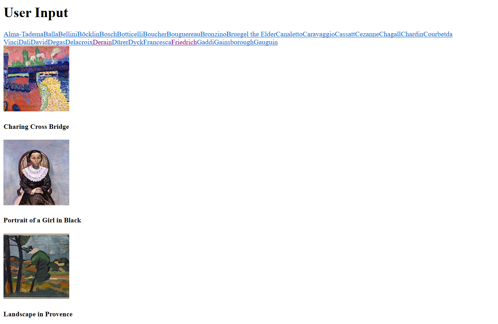
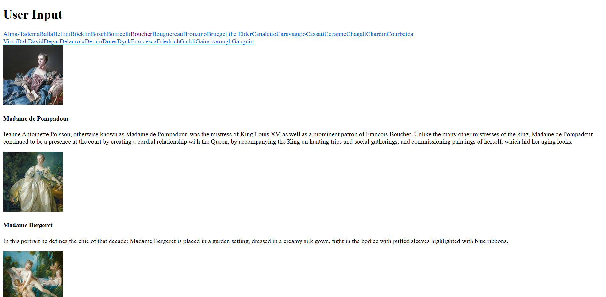

# lab10设计文档

## Exercise7

本练习提供了两种方法访问数据库

### 截图 
 
 

### 方法1：使用PDO访问数据库

首先设置变量pdo来连接数据库，然后设置PDO错误处理模式为异常模式，设置变量sql从表Artists中取数据根据LastName查询所有列（即设置查询语句），使用query执行查询语句，然后遍历查询结果，最后输出并终止连接

### 方法2：使用MySQLi访问数据库

设置变量connection来连接数据库，然后检测是否连接成功，如果连接失败，返回连接失败的错误代码，设置查询语句从表Genres中取数据根据GenreName查询所有列,执行查询语句，遍历查询结果输出并终止连接

## Exercise8

本练习设置了三个不同的函数

### 截图
 

### 函数 outputArtists()

设置查询语句从表Artists中取数据根据LastName查询第0个到第30个列，为每一个数据的LastName都添加一个超链接，当该连接被点击时，a的classname被设置为active。

### 函数 outputPaintings()

当LastName对应的超链接被点击时，使用PDO连接数据库，设置PDO错误处理为异常模式，从表Paintings中取数据查询某一AryistId对应的Paintings,调用outputSinglePainting($row)输出相关信息

### 函数outputSinglePainting($row)

使用echo添加html元素，以输出画作以及标题和描述

## Exercise9

### 截图
 

执行sql语句的方式有以下几种

### 使用exec()

使用该语句会返回受此语句影响的行数。

### 使用query()

针对成功的 SELECT、SHOW、DESCRIBE 或 EXPLAIN 查询，将返回一个 mysqli_result 对象。针对其他成功的查询，将返回 TRUE。如果失败，则返回 FALSE。

### 使用PDO中的预处理语句prepare()和execute()

预处理语句的好处是：可以防止MySQL注入，并且查询只需一次，避免重复分析，提高效率