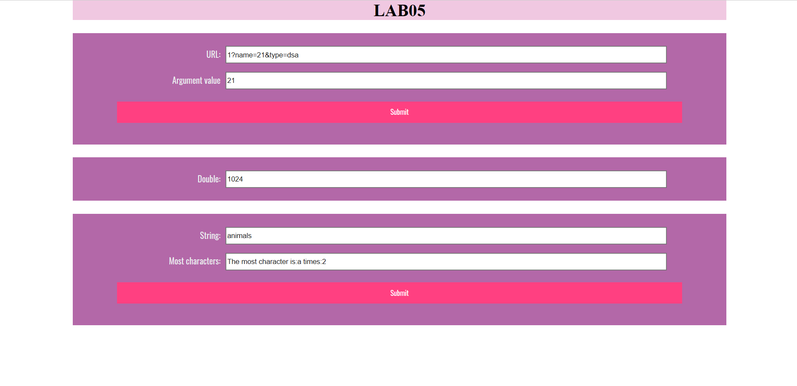
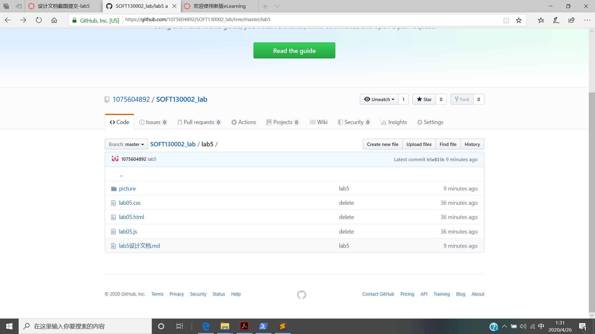

lab5设计文档
==========

## 截图
### 网页效果截图

-------------------

## 设计思路
### 第一部分
首先使用split(“&”)函数将url字符串以字符“&”为单位分开，得到数组url_str，再使用substr(url_str[0].indexOf("?")+1,url_str[0].length-url_str[0].indexOf("?"))函数将url_str[0]中“？”前面（包括“？”）的字符串删掉。这样url_str的每个元素的的格式均为“（参数名）=（参数值）”。再使用url_str[i].split("=")将url_str每个元素的参数名和参数值分开，使用循环判断每个参数名是否为name，如果是,将url_result的值改为相应参数值，否将url_result的值改为"没有找到name参数"。

-------------------

### 第二部分
先将mul的值设为1，使用setInterval("timeTest()",5000)使得没过5秒运行一次timeTest()函数，在timeTest()函数中将mul的值设置为原来的两倍，并判断是否还能继续运行一下次函数。判断方法，使用getSeconds得到当前时间的秒数，若60-当前秒数<5，则无法运行下一次，使用clearInterval(judge)函数停止运行。

-------------------

### 第三部分
 先将出现最多字符设为“”，最多次数设为0。再使用对字符串中每一个字符分别循环判断有几个字符与他相同，使用另一变量记录下次数，若该次数大于之前的最多次数，将最多次数设为该次数，并继续下一次循环直至判断完所有字符。